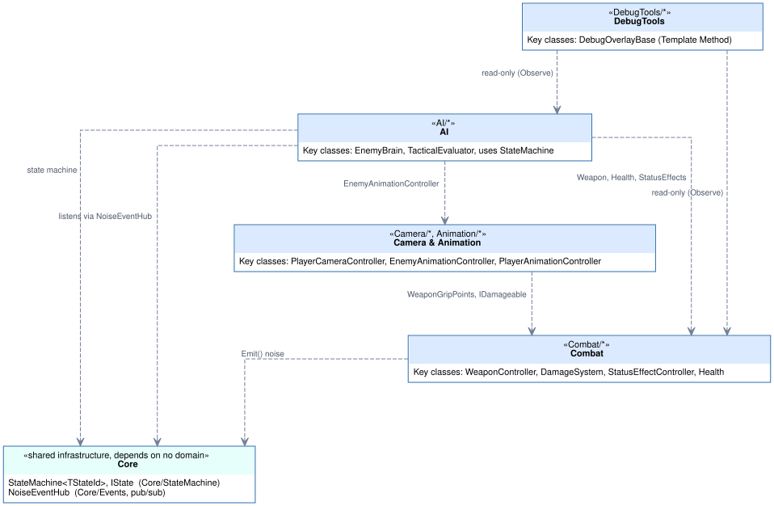
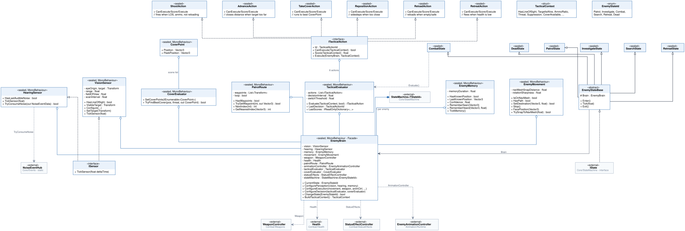
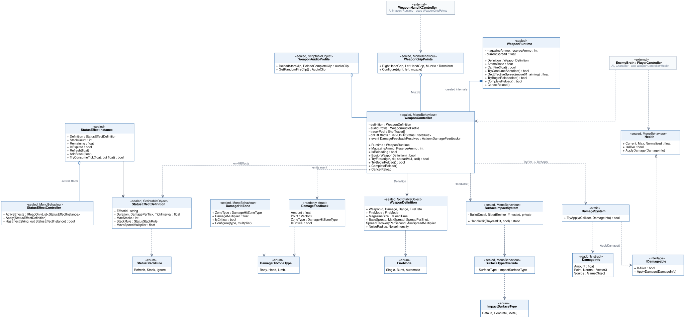
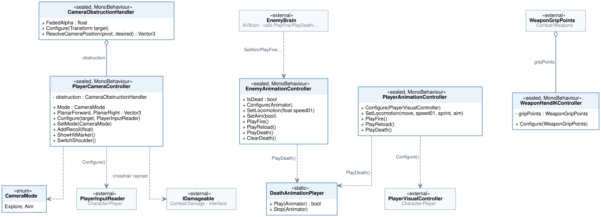
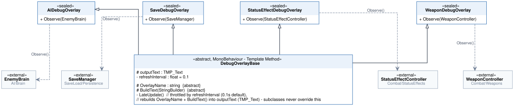

# Class diagrams

Five UML class diagrams, generated straight from the current source under `Assets/_Project/` —
one per major domain (AI, Combat, Camera & Animation, DebugTools), plus one domain-level overview
that ties them together. Each `.svg` has its `.dot` source next to it in this folder; regenerate
after a structural change with `dot -Tsvg <name>.dot -o <name>.svg` (Graphviz).

## Overview — how the four domains connect

No methods here on purpose — this is the "which domain is allowed to depend on which" map.
`Core/` (the state machine engine and the event hub) is the only thing every domain may depend
on; `AI` depends on `Combat` and `Camera & Animation` for execution (movement, weapon, animation)
but never the other way around; `DebugTools` only ever reads.

## AI

`EnemyBrain` is a Facade: it owns every AI sub-system by composition/aggregation and keeps its
own `StateMachine<EnemyStateId>` (from `Core/StateMachine`). It does hold the perception-to-state
decision rule itself (`UpdatePerceptionDrivenState`: dead > mid-Retreat > Combat > Investigate >
Search > Patrol, highest priority first) and assembles the `TacticalContext` passed to the
evaluator (`BuildTacticalContextInternal`) — but it never senses, scores actions, or executes
directly; those stay in the sub-systems it composes. `TacticalEvaluator` scores `ITacticalAction`
— six concrete Strategy implementations, one class each, added without touching the evaluator.
`EnemyStateBase` states implement `IState` and each own exactly one behaviour (Patrol,
Investigate, Combat, Search, Retreat, Dead).

## Combat

One damage pipeline (`IDamageable` → `Health`) serves Player and Enemy alike, but the two damage
sources enter it differently: bullets resolve a hit collider and call `DamageSystem.TryApply`,
while status-effect damage-over-time already knows its target and calls that target's
`IDamageable.ApplyDamage` directly from `StatusEffectController` — both paths land on the same
`Health` component either way. `WeaponController` creates its own `WeaponRuntime` (composition)
and reads `WeaponDefinition` / `WeaponAudioProfile` as data assets, so a new weapon is a new
asset, not new code.

## Camera & Animation

Three independent controllers — camera, player animation, enemy animation — each read from
`Combat` / `Character` where they need to, but never from each other. `DeathAnimationPlayer` is
the one static utility both animation controllers call so the death clip only has one code path.

## DebugTools

Template Method: `DebugOverlayBase.LateUpdate()` is fixed (throttled rebuild, draw), every
concrete overlay only implements `OverlayName` / `BuildText()` plus an `Observe(...)` entry point
into whichever system it displays — adding a new overlay never touches the base class.
