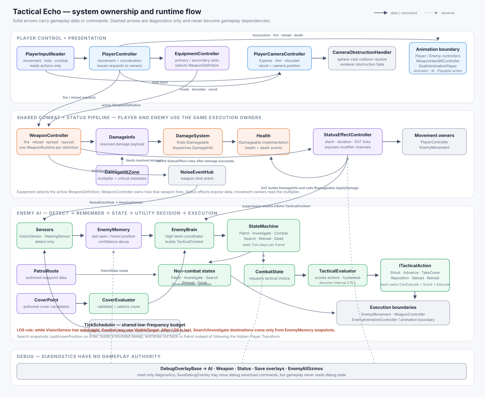

# Tactical Echo

It prioritises technical depth, clear ownership boundaries, debugging visibility and
maintainable code over visual polish. Every system below is built so that one class owns one
responsibility and the seams between them are visible and testable.



Full detail: [`Docs/ARCHITECTURE.md`](Docs/ARCHITECTURE.md) for the rules,
[`Docs/CODEBASE_MAP.md`](Docs/CODEBASE_MAP.md) for who owns what and where to extend,
and [`Docs/CLASS_DIAGRAMS.md`](Docs/CLASS_DIAGRAMS.md) for five UML class diagrams (one per
domain plus a domain-level overview).

## Demo video

[](https://youtu.be/VHTSJ0SswnM)

Click the thumbnail above to watch on YouTube.

## Running the demo

1. Open the project in **Unity 6000.3.11f1**.
2. Open `Assets/_Project/Scenes/TacticalEcho_Sandbox.unity`.
3. Press Play. `Enemy_01` wires its own vision target (the player, resolved by the `Player` tag
   in `EnemyBrain.Awake`) and its own cover list (every `CoverPoint` in the scene, resolved in
   `CoverEvaluator.Awake`).

### Controls

| Input | Action |
| --- | --- |
| `W A S D` | Move |
| Mouse | Look |
| Shift | Sprint |
| Left mouse | Fire |
| Right mouse | Aim (toggle by default, hold if an Aim action is bound) |
| `R` | Reload |
| `Q` | Switch camera shoulder |
| `F5` / `F9` | Save / load — only when a `SaveDebugOverlay` is in the scene |

Any action with an `InputActionReference` assigned on
`PlayerInputReader` uses that instead.

### Seeing the systems work

Add these components to an empty GameObject to watch a system live; each builds its own
screen-space text, so no UI wiring is needed.

| Component | Shows |
| --- | --- |
| `AIDebugOverlay` | Enemy state, tactical action scores, memory confidence |
| `WeaponDebugOverlay` | Ammo, reload and fire timing, current vs effective spread |
| `StatusEffectDebugOverlay` | Active effects, stacks, remaining time, damage tick |
| `SaveDebugOverlay` | Save files on disk, last write/read result and rejection reason |

`EnemyAIGizmos` draws perception cones and remembered positions in the Scene view, and
`PatrolRoute` draws its waypoints.

## What is implemented

**Player and camera** — character-controller movement with sprint, gravity and grounded stick;
third-person camera with Explore/Aim modes, shoulder switching, recoil kick and a crosshair that
reacts to damageable targets; camera collision that stops the camera at walls and renderer fading
for anything that still blocks the view.

**Combat** — hitscan rifle and sidearm with fire modes, magazine/reserve ammo, reload lifecycle,
movement- and fire-dependent spread, muzzle flash, tracers and surface impacts. One shared damage
pipeline (`DamageInfo` → `DamageSystem` → `IDamageable` → `Health`) serves Player and Enemy alike,
with body-part hit zones supplying multipliers and headshot criticals.

**Enemy AI** — vision and hearing sensors that only detect; `EnemyMemory` that remembers and
decays confidence; a state machine (Patrol, Investigate, Combat, Search, Retreat, Dead); a utility
evaluator that scores tactical actions with a decision interval and switch-threshold hysteresis;
cover selection and peeking. Patrol walks an authored `PatrolRoute`, and Search sweeps a ring
around the last remembered position, bounded by a timeout back to Patrol.

**The acceptance rule** — after losing line of sight the AI reads only `EnemyMemory` snapshots.
No system below the sensors touches the live player `Transform`.

**Status effects** — definition/instance/controller split with stacking rules, damage-over-time
that re-enters the shared damage pipeline, and modifier channels. Movement speed is the first
channel: effects publish a multiplier and the movement owners read it, so a Slow is a data asset
rather than new code.

**Inventory and equipment** — item definitions link to weapon definitions; `EquipmentController`
owns the primary/secondary slots and pushes the active slot's weapon into the shared
`WeaponController`, which keeps one runtime per weapon so ammo survives a swap.

**Save/load** — atomic temp/main/backup writes, a schema version that is actually compared,
ordered migration steps, and validation that rejects structurally broken saves so they fall
through to the backup.

**Performance** — a shared `TickScheduler` budget that AI perception runs on, and allocation-free
physics queries throughout.

## Technology

- Unity 6000.3.11f1, Universal Render Pipeline 17.3.0
- Input System 1.19.0, AI Navigation 2.0.11
- TextMeshPro for all text UI

## Layout

All first-party code lives under `Assets/_Project`; third-party art, audio and VFX are isolated
under `Assets/_ThirdParty`, and plugins under `Assets/Plugins`.

```text
Assets/_Project/
  AI/            Sensors, memory, brain, states, tactical actions, cover, patrol, navigation
  Animation/     Animator parameter owners and the shared death clip playback
  Camera/        Third-person camera and obstruction/collision
  Character/     Player input and controller
  Combat/        Weapons, damage pipeline, health, status effects, impacts
  Core/          State machine and event primitives
  DebugTools/    Read-only overlays
  Input/         Input action asset
  Inventory/     Items, inventory, equipment slots
  Optimization/  Shared tick budget
  SaveLoad/      Contracts, schema, persistence
  Scenes/        TacticalEcho_Sandbox
  UI/            Combat HUD, floating damage numbers
```

## Working on this project

`Docs/CODEBASE_MAP.md` lists, for every file, what it owns, what to extend there and what to keep
out. Before adding a class, find the owner of that responsibility in the map and extend it.
